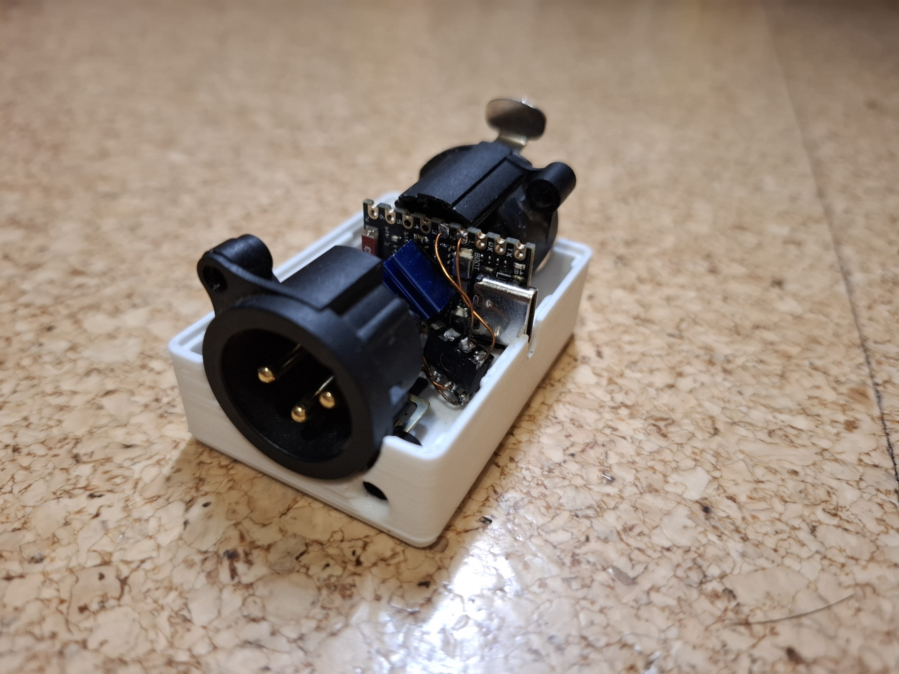

# WLED-DMX-Brick
I Build this brick with an DMX In and Out and an ESP32-S3 with WLED in the middle.
The use case is to put it in a DMX line, and have an automatic scene on boot and a simplified UI for controlling the Lamps but it is always possible to control the Lamps by the central DMX-Master for the bigger events in the house.


I used:
- ESP32-S3 Mini / Zero
- SN75176
- Neutrik XLR 
- NC3FAAH
- NC3MAAH

All in a 3D printed box. https://www.printables.com/model/1100733-dmx-wled-brick


## Detailed guilding guide:


### Flash the ESP32-S3:

You can flash it with https://wled-compile.github.io/.
You can load my config from the file WLED_compile_DMX-Brick.json or paste my config in step 4 of the website.
```[env:custom_build]
board = lolin_s3_mini ;; -S3 mini, 4MB flash 2MB PSRAM 
platform = ${esp32s3.platform}
platform_packages = ${esp32s3.platform_packages}
upload_speed = 921600
build_unflags = ${common.build_unflags}
build_flags = ${common.build_flags} ${esp32s3.build_flags} -D WLED_RELEASE_NAME=\"ESP32-S3_4M_qspi\"
  -D ARDUINO_USB_CDC_ON_BOOT=1 -DARDUINO_USB_MODE=1      ;; for boards with USB-OTG connector only (USBCDC or "TinyUSB")
  -D BOARD_HAS_PSRAM
  -D LOLIN_WIFI_FIX ; seems to work much better with this
  -D WLED_WATCHDOG_TIMEOUT=0
  -D WLED_ENABLE_DMX
lib_deps = ${esp32s3.lib_deps}
board_build.partitions = ${esp32.default_partitions}
board_build.f_flash = 80000000L
board_build.flash_mode = qio
monitor_filters = esp32_exception_decode```

1. Start the build and flash the ESP.
2. Build the 'Brick':
3. Print the case from printables.
4. I connect all components with thin enameled wire but you also can use other wires.

### Connection scheme:



### Configure the WLED instance:
1. The config of the data pin to the transceiver is hardcoded to pin 2
2. Config the pin to the DE pin of the transceiver as the LED Relay or an LED Switch (in my schematic pin 3).
3. Config the DMX Chanels as you preferre.
4.Adding some LEDs, wich has the chanels of your DMX Chanel Config.
5. Notice that WLED is realy limited with the DMX settings.
6. Further informations on https://kno.wled.ge/interfaces/dmx-output/ .
